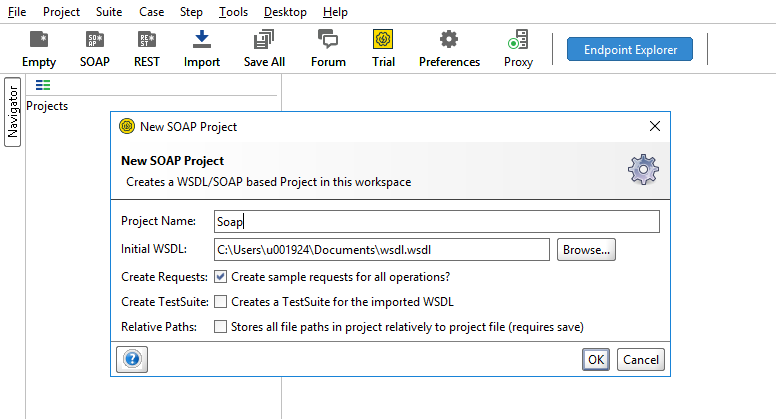
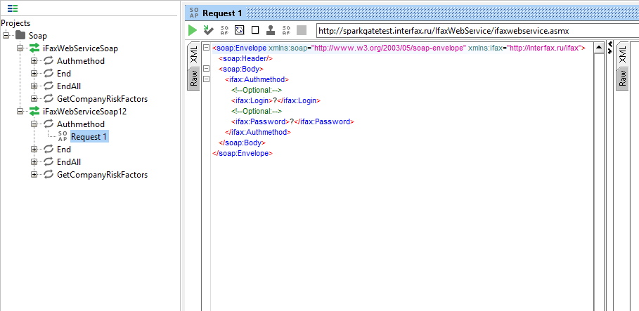
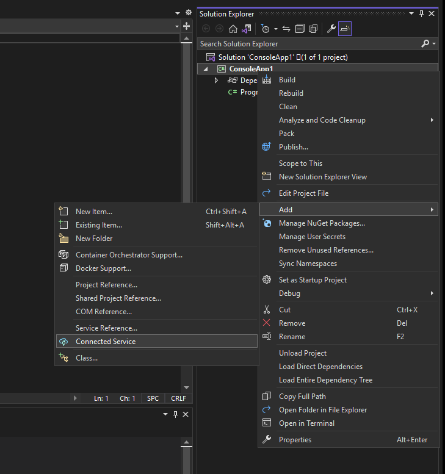
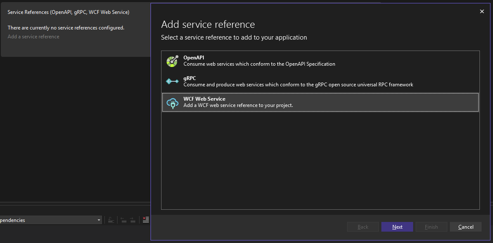
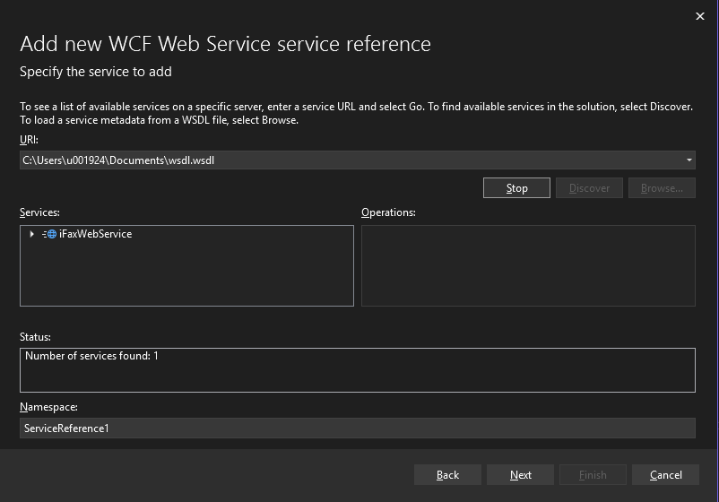

# Soap.Client

## Общая информация
- `SOAP` - протокол обмена структурируемыми сообщениями. `Soap` является расширением протокола xml-rpc.
- `WSDL` - язык описания веб-сервисов и доступа к ним, основанный на языке `xml`.

### Структура сообщения

- `Envelope` — корневой элемент, который определяет сообщение и пространство имен, использованное в документе.
- `Header` — содержит атрибуты сообщения, например: информация о безопасности или о сетевой маршрутизации.
- `Body` — содержит сообщение, которым обмениваются приложения.
- `Fault` — необязательный элемент, который предоставляет информацию об ошибках, которые произошли при обработке сообщений.
```xml
<?xml version="1.0" encoding="utf-8"?>
<soap:Envelope xmlns:xsi="http://www.w3.org/2001/XMLSchema-instance" xmlns:xsd="http://www.w3.org/2001/XMLSchema" xmlns:soap="http://schemas.xmlsoap.org/soap/envelope/">
    <soap:Body>
        <getProductDetails xmlns="http://warehouse.example.com/ws">
            <productID>12345</productID>
        </getProductDetails>
    </soap:Body>
</soap:Envelope>
```

## Инструкция по работе

- Воспользоваться интерфейсом `ISoapClient`
```csharp
public interface ISoapClient
{
    Task<TResponse> PostAsync<TResponse>(
        SoapVersion soapVersion,
        IEnumerable<XElement> bodies,
        IEnumerable<XElement>? headers = null,
        string? path = null,
        string? action = null) where TResponse : BodyResponse;
}
```
- Параметры интерфейса
  - Версия Soap
  - Наполнение Body
  - Наполнение Header
  - Путь к ресурсу
  - Вызываемое действие (Действие можно увидеть, сгенерировав модели через VS. Пример: "http://interfax.ru/ifax/Authmethod")

- Вызвать метод UseSoapHttpClient при конфигурировании ядра сервиса
- Указать настройки конфигурации клиента в `appsettings`
```json
{
    "SoapClientConfiguration": {
        "Url": "http://sparkgatetest.interfax.ru",
        "Timeout": 30,
        "Proxy": {
            "Enabled": true,
            "Host": "qsquidtdzi2.dz.lo",
            "Port": 3128,
            "UseDefaultCredentials": true
        }
    }
}
```
- Получить `SoapClient` через `DI`
```csharp
private readonly ISoapClient _soapClient;

public SoapService(ISoapClient soapClient)
{
    _soapClient = soapClient;
}
```
- Для более простой отправки запроса реализован метод расширения для интерфейса `ISoapClient`
```csharp
public static class SoapClientExtensions
{
    public static async Task<TResponse> PostAsync<TResponse>(
        this ISoapClient soapClient,
        SoapVersion soapVersion,
        object body,
        string? path = null,
        string? action = null) where TResponse : BodyResponse
    {
        var xBody = CreateXElement(body);
        return await soapClient.PostAsync<TResponse>(soapVersion, new []{xBody}, null, path, action);
    }

    public static XElement CreateXElement(object obj)
    {
        var serializer = new XmlSerializer(obj.GetType());
        var stringWriter = new StringWriter();

        using (var writer = XmlWriter.Create(stringWriter))
        {
            serializer.Serialize(writer, obj);
        }

        var element = XElement.Parse(stringWriter.ToString());

        return element;
    }
}
```
> Для отправки запроса необходимо обязательно указать версию `Soap` и `Body` запроса, также рекомендуется доменное имя прописывать в настройках клиента, а путь к ресурсу отправлять через параметры метода.
```csharp
var request = new AuthmethodRequest("login", "password");
var result = await _soapClient.PostAsync<AuthmethodResponseBody>(SoapVersion.Soap11, request, Path);
```

### Работа с SOAP

- Сгенерировать модели запроса и ответа, обработав wsdl-схему.
  - `SoapUI` - примеры запроса и ответа в уже их конечном виде
  - `VisualStudio` - рабочий клиент и модели запроса и ответа

#### SoapUI

В окне приложения SoapUI необходимо выбрать создание Soap-проекта, после чего выбрать файл типа `wsdl`, настройки можно оставить стандартными:



Приложение сгенерирует примеры запросов, также здесь можно увидеть url-адрес, на который необходимо отправлять запрос:



#### Visual Studio

В VS можно сгенерировать сразу рабочего клиента и модели запроса и ответа в формате `wcf`.

Для этого необходимо создать новую службу:



Далее необходимо выбрать `ServiceReferences` и `Wcf Web Services`:



После необходимо выбрать файл в формате `wsdl` либо указать `url`:



После создания клиента и моделей можно попробовать отправить запрос, делать это нужно как показано далее, чтобы указать настройки прокси:

```csharp
const string url = "http://interfax.ru/ifax";
var binding = new BasicHttpBinding
{
    AllowCookies = true,
    UseDefaultWebProxy = false
};

var customBinding = new CustomBinding(binding);

var httpElement = customBinding.Elements.Find<HttpTransportBindingElement>();
httpElement.Proxy = new WebProxy("qsquidtdzi2.dz.lo", 3128)
{
    UseDefaultCredentials = true
};

var address = new EndpointAddress(url);
await using var client = new iFaxWebServiceSoapClient(iFaxWebServiceSoapClient.EndpointConfiguration.iFaxWebServiceSoap12);

client.Endpoint.Binding = customBinding;
client.Endpoint.EndpointBehaviors.Add(new MessageInspectorBehavior());

var response = await client.AuthmethodAsync("login", "password");
var stringResponse = response.ToString();
```
Обязательно необходимо подключать следующие библиотеки (библиотеки версии 6 не работают на 01.08.2023):
```xml
<ItemGroup>
    <PackageReference Include="System.ServiceModel.Duplex" Version="4.10.2" />
    <PackageReference Include="System.ServiceModel.Http" Version="4.10.2" />
    <PackageReference Include="System.ServiceModel.NetTcp" Version="4.10.2" />
    <PackageReference Include="System.ServiceModel.Primitives" Version="4.10.2" />
    <PackageReference Include="System.ServiceModel.Security" Version="4.10.2" />
</ItemGroup>
```
Можно подключить "логирование", для этого необходимо создать инспектор сообщений.

Название классу дается произвольно, его необходимо наследовать от `IClientMessageInspector` и `IEndpointBehavior`.

Для логирования необходимо использовать методы `AfterReceiveReply` и `BeforeSendRequest`
```csharp
public class MessageInspectorBehavior : IClientMessageInspector, IEndpointBehavior
{
    public void AfterReceiveReply(ref System.ServiceModel.Channels.Message reply, object correlationState)
    {
        Console.WriteLine(reply.ToString());
    }

    public object BeforeSendRequest(ref System.ServiceModel.Channels.Message request, System.ServiceModel.IClientChannel channel)
    {
        Console.WriteLine(request.ToString());
        return null;
    }

    public void AddBindingParameters(ServiceEndpoint endpoint, System.ServiceModel.Channels.BindingParameterCollection bindingParameters)
    {
        // Do nothing.
    }

    public void ApplyDispatchBehavior(ServiceEndpoint endpoint, EndpointDispatcher endpointDispatcher)
    {
        // Do nothing.
    }

    public void Validate(ServiceEndpoint endpoint)
    {
        // Do nothing.
    }

    public void ApplyClientBehavior(ServiceEndpoint endpoint, ClientRuntime clientRuntime)
    {
        // Add the message inspector to the as part of the service behaviour.
        clientRuntime.ClientMessageInspectors.Add(this);
    }
}
```
Для использования данного класса необходимо выполнить следующее действие
```csharp
client.Endpoint.EndpointBehaviors.Add(new MessageInspectorBehavior());
```
Пример запроса и ответа с помощью такого клиента
```xml
<?xml version="1.0" encoding="utf-16"?>
<s:Envelope xmlns:s="http://schemas.xmlsoap.org/soap/envelope/">
    <s:Header>
        <Action s:mustUnderstand="1" xmlns="http://schemas.microsoft.com/ws/2005/05/addressing/none">http://interfax.ru/ifax/Authmethod</Action>
    </s:Header>
    <s:Body>
        <Authmethod xmlns:i="http://www.w3.org/2001/XMLSchema-instance" xmlns="http://interfax.ru/ifax">
            <Login>login</Login>
            <Password>password</Password>
        </Authmethod>
    </s:Body>
</s:Envelope>
```
```xml
<?xml version="1.0" encoding="utf-16"?>
<soap:Envelope xmlns:soap="http://schemas.xmlsoap.org/soap/envelope/" xmlns:xsd="http://www.w3.org/2001/XMLSchema" xmlns:xsi="http://www.w3.org/2001/XMLSchema-instance">
    <s:Header xmlns:s="http://schemas.xmlsoap.org/soap/envelope/" />
    <soap:Body>
        <AuthmethodResponse xmlns="http://interfax.ru/ifax">
            <AuthmethodResult>False</AuthmethodResult>
        </AuthmethodResponse>
    </soap:Body>
</soap:Envelope>
```
